# confuse
**思路正确，处处是巧合**
**对于知识的联想，毫无头绪的时候，回到他的定义上去**
**概念(本质)帮我们理清楚是干什么的，性质帮我们简化操作，最后通过基本方法运算**
充分必要条件？  
如何求 $p^{-1}$  
正交矩阵的模为1  
> 一阶偏导数连续怎么判别，什么是奇点
> 什么是梯度
> 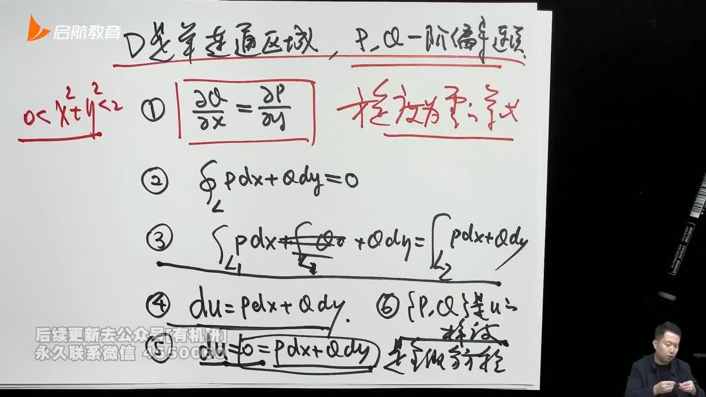
> 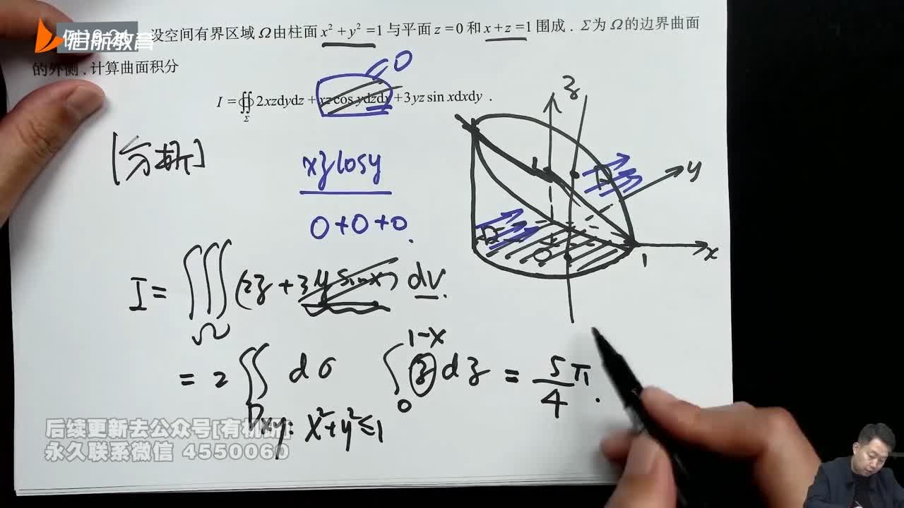
> 做功的方向问题
> 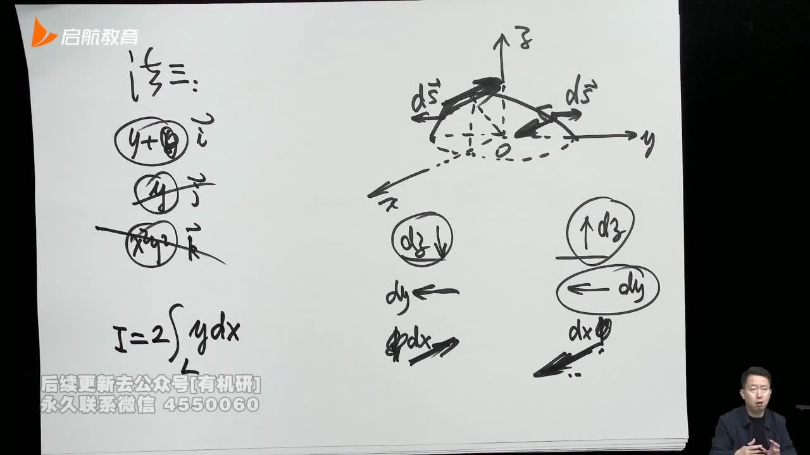
> 第二型曲面积分的计算过程(理解)

## 函数的性质
### 函数的周期性(p94)

#### 习题：
* 7.26周测T12
* 8.02周测T1
## 泰勒展开(15)

### 习题：
* 7.26周测T7
* 8.02周测T7
## 洛必达法则(p22)
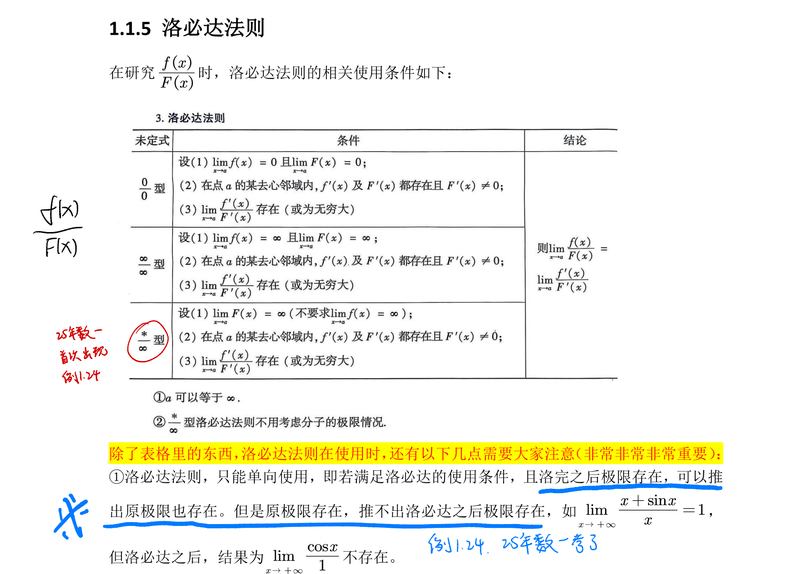
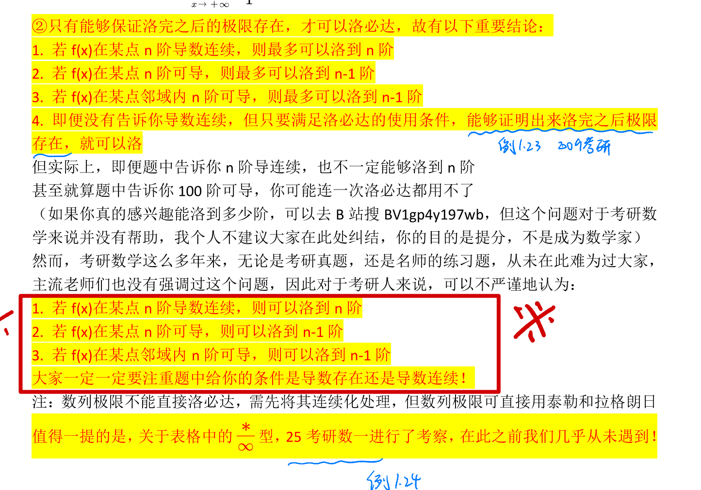
## 拉格朗日中值定理(p26)

### 习题：
* 8.02周测T14
## 中值定理(p166)

### 习题：
* 7.26周测T5
## 渐近线(p156)

### 习题：
* 7.26周测T11
* 8.02周测T11
## 导数相关计算
### 基本运算(p193)
积分和求导互为逆运算
**$(tan'x)=sec^{2}x$**
**$cotx=1/tanx$ $cscx=1/sinx$ secx=1/cosx** 
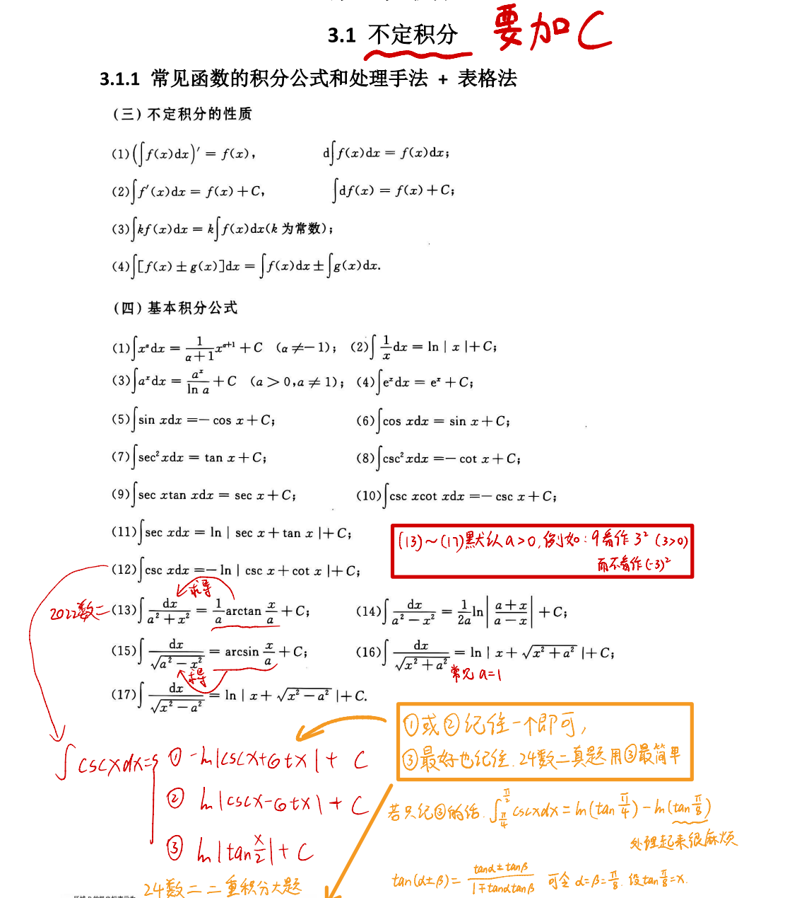
### 脱帽法(p142)
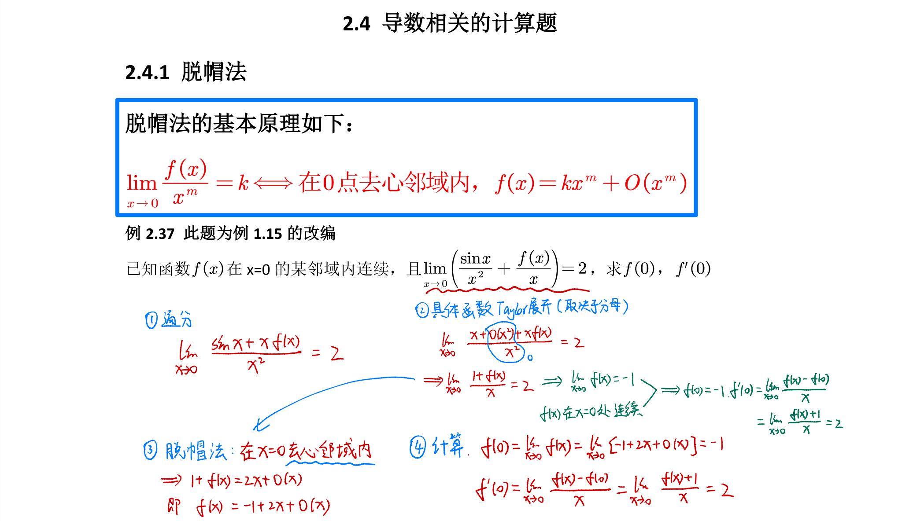
#### 习题：
* 8.09周测T5
### 变限积分求导(p142)
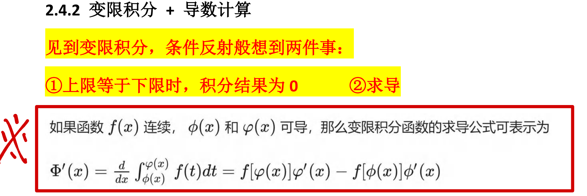
变限积分的参数方程求法 (p27)
#### 习题: 
* 7.26周测第九题 (p401)  参数方程的二重积分 

### 参数方程求导(p148)
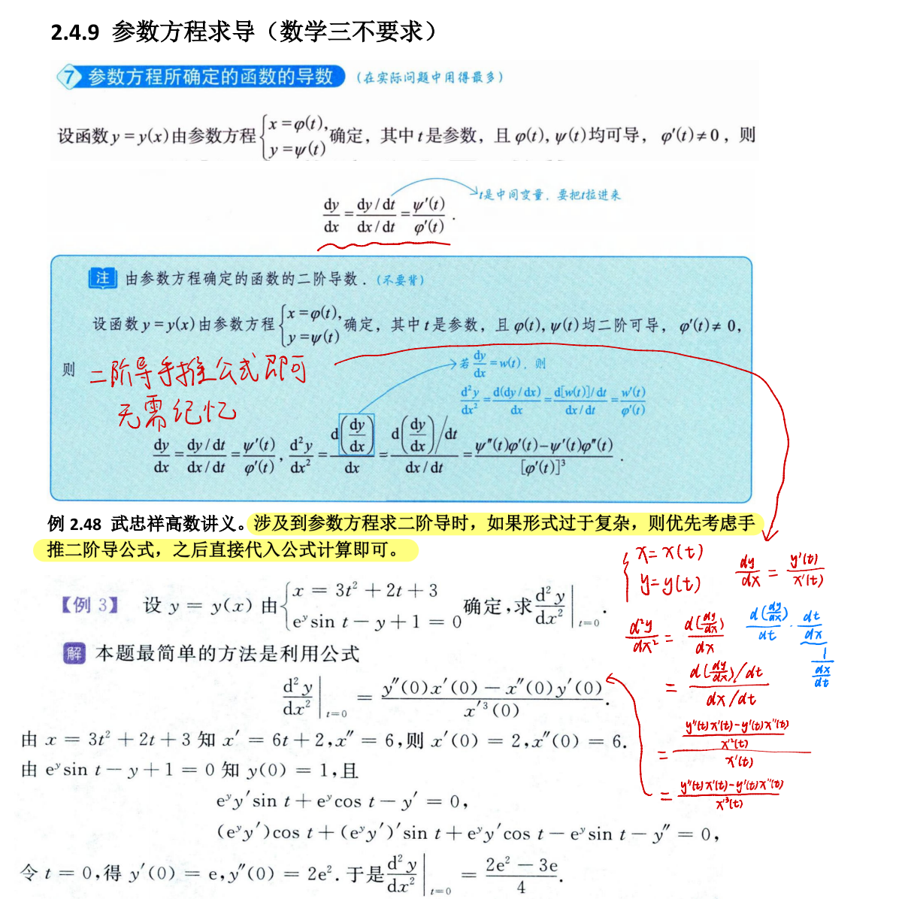

## 定积分的几何应用
### 旋转体体积(p268)  
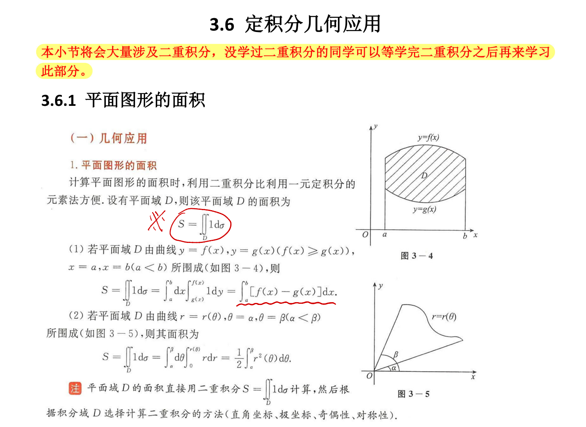
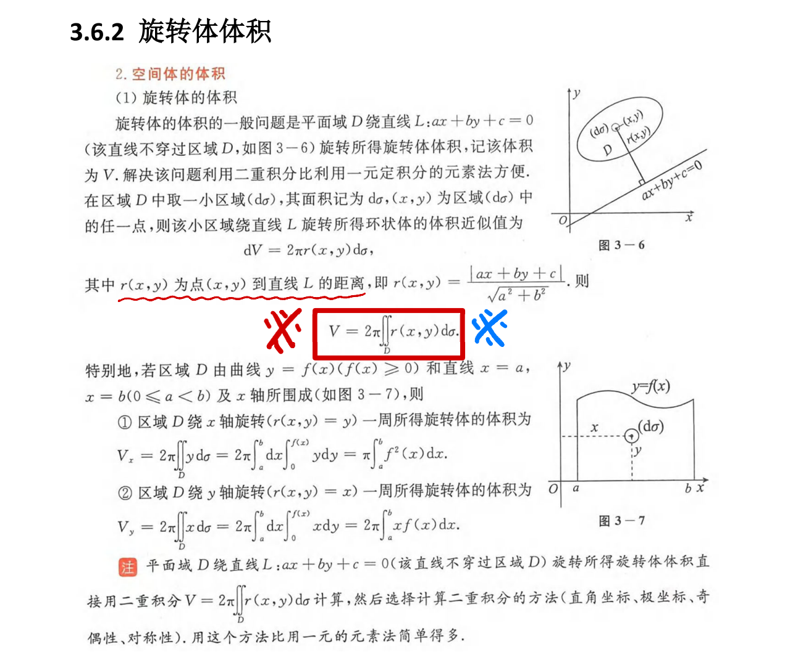
其中$2Πr(x,y)$为圆柱的高，$r(x,y)$为点到直线$L$的距离
### 旋转体侧面积(p274)
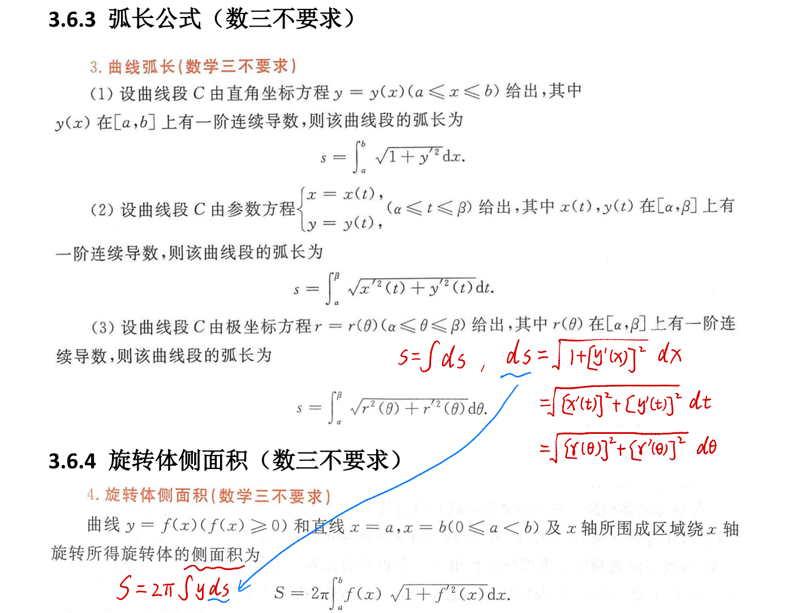
## 二重积分积分区域的确定
**可以观看小崔说数的讲解**
**描点法**如果能推测出大概就不用继续往下看了(取特殊点)
能用直角坐标系确定用直角坐标系确定，不能用直角坐标系确定转换为极坐标用r(极径)来确定  
对应参数方程可以使用**描点法**，可通过函数周期性和求导单单调性进行分析
## 二重积分的计算(p383)
被积函数相当于高，区域D相当于底面积
积分上下限只与**积分变量**相关，积分变量才是自变量
**上下限的确定：** 后积先定限，限内画条线，先交写下限，后交写上限
### 习题：
* 7.26周测T9  
* 8.02周测T12 
## 二重积分求导(p413)  
因为二重积分的计算方法是将后面的积分算出来后代到前面来，可将二重积分转化为定积分(变上限积分)    
**变上限积分求导原则：被积函数中不能含有变上限中的参数**
一旦违反变上限积分求导原则，就不能够直接求导。**此时就需要交换积分次序**
> 对谁求导，变上限中就要含有谁。**若变上限的参数不含有则需要换元来改变里面参数**
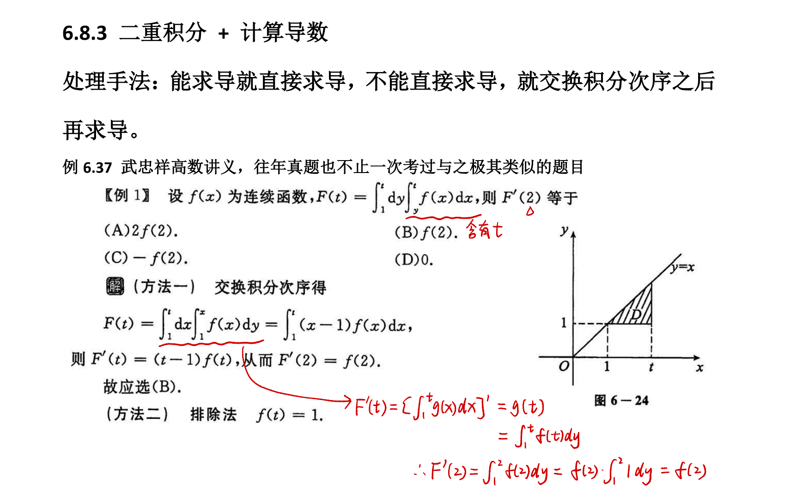

## 驻点和拐点(p130)
### 驻点和极值点有关
部分截图

### 拐点与凹凸性有关
部分截图

#### 习题：
* 8.02周测T2
## 分部积分计算  
反对幂指三，越靠左越难积分，越靠右越容易积分    
分部积分的本质：一个积分，一个求导。    
**分部积分计算方法**    表格法(p190)  
> 表格法适用于被积函数是两个函数相乘，且其中一个函数经过有限次求导后会变成0的情况
>不适用的情况eg:8.09周测T8  
    
**分部积分的计算逻辑** 本质(p252)
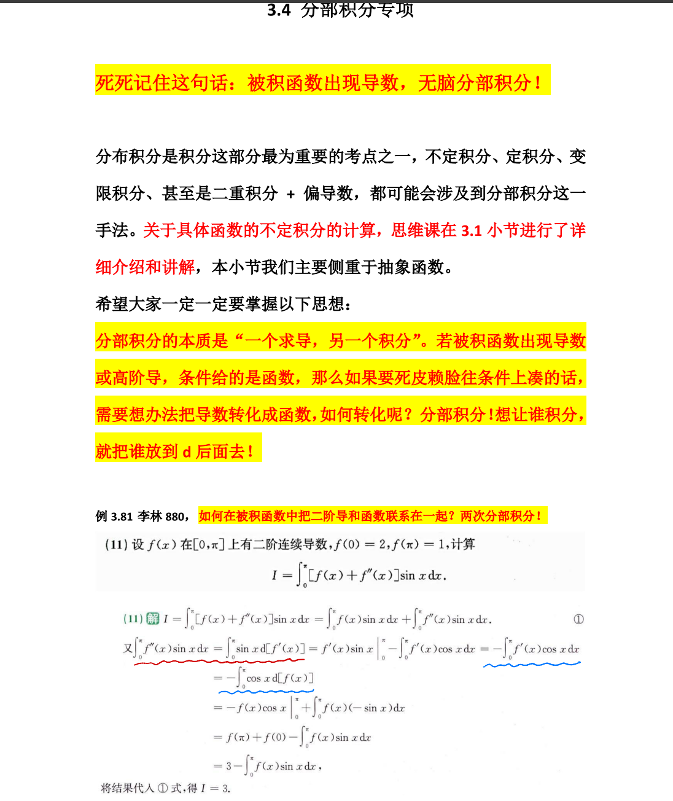
**重点在于计算逻辑**
### 习题：
* 7.26周测T5 (具体函数)
* 8.09周测T8 (抽象函数)
## 反常积分
**瑕点处判别**

### 习题：
* 8.02周测T4
## 微分方程求解
通解并非全部解，解微分方程时无需考虑分母为零   
### 一阶微分方程
**计算方法** (p285)   
#### 习题:   
* 7.26周测第二题   

### 可降解微分方程(p291)  

### 二阶微分方程(p293,p299)

#### 习题：
* 7.26周测T3
## 偏导数的计算(p336)
### 分段函数的多元微分概念题(p332)
区分5.17，5.18和5.24的区别 **去心邻域内表达式是否分段**

#### 习题：
* 8.02周测T5
### 偏导数与全微分    
先代后求的使用条件

#### 习题
* 7.26周测T10
### 无条件极值(p359)
拉格朗日数乘法

#### 习题：
* 7.26周测T13
### 条件极值(p367)

#### 习题：
* 8.02周测T6
## 点火公式
### 习题：
* 7.26周测第九题 (p401)
常规点火公式  
**降幂公式**

参数方程换元    
常用的基本不等式  
> 换元相当于换坐标系，和线性代数一致，会造成伸缩变换。eg:二重积分极坐标系换元  
> 二重积分和三重积分的换元是针对区域进行的，本质上是为了将古怪的区域转换成规则的区域，相当于二次型
> 积分中值定理的思想:整个区域的积分一定满足某一点处被积函数与底面积的乘积
> 积分计算先考虑性质上的问题，eg:对称性，能不能通过性质进行化简
> 对于空间几何区分实心还是空心。投影时，哪个坐标没有把那个坐标消掉即可
> 微元法思想：以常(数)代变(量)，以直(线)代曲(线)
> 当力的方向和运动方向相同时做的是正功，当力的方向与运动方向相反时做的是负功
> 格林公式，联系区间内部和区间边界的转换，与定积分类似
> 格林公式把二型线积分化成二重积分，将边界的计算化到内部去了
> 分母不等于0一阶偏导数连续
> 一型积分为几何量(总质量)，二型积分为物理量(向量，铅锤方向的水流经过曲面的流量)
> 转换投影思想：能不能把三个方向上的投影转化到一个方向上去投
> 旋度和散度？
> 无奇点<=>一阶偏导数连续
> 作图技巧：稍微换一下坐标系的位置可能会看的更清楚一些
