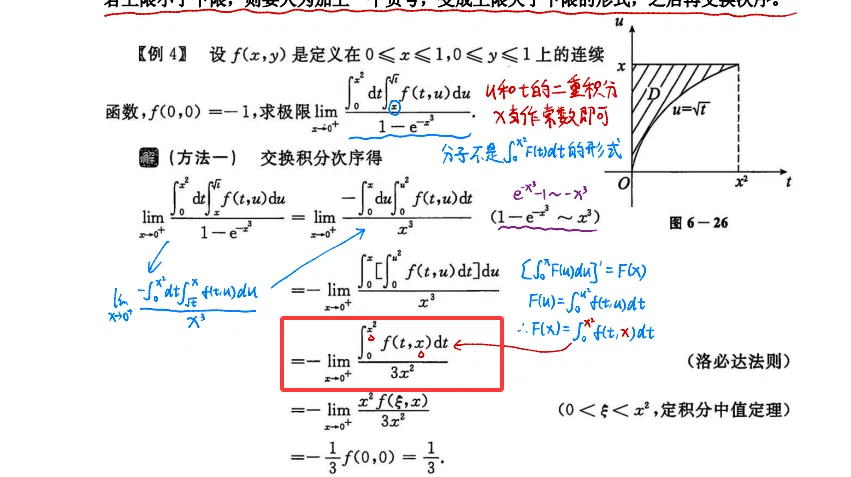
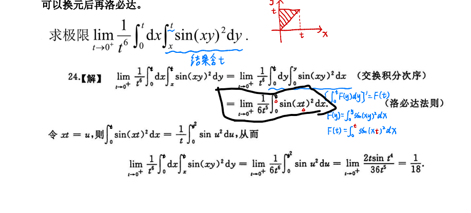

# 典
## 6.35

**Confuse:** 分母是变上限积分，为什么不能接着洛必达，而是使用积分中值定理?
这是一个非常经典且容易踩坑的高数问题。在这个极限中，分母确实是变上限积分（且含有参数），但**不能接着使用洛必达法则**，最核心的原因在于**题目条件不满足洛必达法则的求导要求**。

下面为你详细剖析为什么洛必达在这里失效，以及为什么积分中值定理是唯一可行的优选。

### 一、为什么不能接着用洛必达？

此时的极限式子是：$\lim_{x \to 0^+} \frac{\int_0^{x^2} f(t,x) dt}{3x^2}$

这是一个 $\frac{0}{0}$ 型极限，分子确实可以看成 $x$ 的函数。如果要用洛必达法则，分子必须对 $x$ 求导。分子是一个**变上限积分**，且被积函数里**含有参数 $x$**。

根据**莱布尼茨公式（Leibniz rule）**，对 $x$ 求导应该是：
$$ \frac{d}{dx} \left( \int_0^{x^2} f(t,x) dt \right) = f(x^2, x) \cdot (x^2)' + \int_0^{x^2} \frac{\partial f(t,x)}{\partial x} dt $$
$$ = 2x \cdot f(x^2, x) + \int_0^{x^2} f_x'(t,x) dt $$

如果强行洛必达，分母求导变成 $6x$。
原式变为：
$$ \lim_{x \to 0^+} \frac{2x \cdot f(x^2, x) + \int_0^{x^2} f_x'(t,x) dt}{6x} $$

**发现问题了吗？**
题目条件只给出了 **$f(x,y)$ 是连续函数** 和 $f(0,0)=-1$。**没有给出 $f$ 关于第二个变量偏导数存在**的条件。
既然 $f_x'$ 可能不存在，那么 $\int_0^{x^2} f_x'(t,x) dt$ 这一项就无法处理，洛必达法则彻底失效。强行使用会导致逻辑崩盘。

### 二、为什么积分中值定理是破局关键？

既然求导走不通（洛必达失效），我们必须想办法**去掉分子上的积分号**，同时利用上 $f$ 连续这个条件。积分中值定理完美契合：

1. **适用条件**：$f(t,x)$ 在 $t$ 属于 $[0, x^2]$ 上是连续的（题目说 $f$ 连续，满足条件）。
2. **使用定理**：由积分中值定理，存在 $\xi \in (0, x^2)$，使得：
   $$ \int_0^{x^2} f(t,x) dt = f(\xi, x) \cdot (x^2 - 0) = x^2 f(\xi, x) $$
3. **求极限**：
   原式 = $\lim_{x \to 0^+} \frac{x^2 f(\xi, x)}{3x^2} = \lim_{x \to 0^+} \frac{f(\xi, x)}{3}$
4. **处理 $\xi$**：因为 $0 < \xi < x^2$，当 $x \to 0^+$ 时，由夹逼定理可知 $\xi \to 0^+$。
   又因为 $f$ 连续，所以 $\lim_{x \to 0^+ \\ \xi \to 0^+} f(\xi, x) = f(0,0) = -1$。
5. **得出结论**：$\frac{-1}{3} = -\frac{1}{3}$。

### 💡 总结与启示

*   **遇到参数在积分号内且只有连续条件**：绝对不要盲目洛必达，优先想**积分中值定理**或者**泰勒展开**。
*   **变上限积分求导（莱布尼茨公式）**：只要对变限积分求导，就必须检查被积函数对参数求偏导是否可导。条件不够，坚决不用洛必达。
*   **积分中值定理**：它是处理“积分号内含有极限变量”的绝佳工具，能直接将定积分转化成函数值乘以区间长度，从而大幅简化极限。

这也正是图片里笔记特别在旁边写了“洛必达法则”却划掉，改用积分中值定理的原因所在。这道题是典型的“防洛必达陷阱题”。
## 6.36

**下一步换元再洛的原因还是因为不知道偏导数是否存在导致的吗**
**不是的。这里的原因和上一题完全不同。**

上一题是因为 $f(x,y)$ 是抽象函数，题目只给了“连续”条件，没有给“可偏导”条件，所以强行洛必达会卡在求偏导那一步。

**但这道题（图片中的例题）里的函数是具体的三角函数 $\sin(xy)^2$，它无穷可微，偏导数显然存在。** 既然偏导数存在，为什么还要先换元再洛必达呢？

核心原因是：**如果直接洛必达，会引入更复杂的积分，导致陷入死循环或越算越难。**

我们来对比一下“直接洛必达”和“换元后再洛必达”的区别，你就能瞬间明白：

### 假设不换元，直接洛必达会怎样？
当前式子：$\lim_{t \to 0^+} \frac{\int_0^t \sin(xt)^2 dx}{6t^5}$

分子是一个变上限积分，且被积函数含有参数 $t$。根据莱布尼茨公式求导：
分子求导 $= \sin(t \cdot t)^2 \cdot 1 + \int_0^t \frac{\partial}{\partial t}[\sin(xt)^2] dx$
$= \sin(t^2)^2 + \int_0^t 2x\sin(xt)\cos(xt) dx$
$= \sin(t^2)^2 + \int_0^t x\sin(2xt) dx$

发现了吗？求导之后，**分子依然含有一个无法直接计算的积分 $\int_0^t x\sin(2xt) dx$**，而且 $t$ 依然纠缠在被积函数里。如果继续洛必达，就要对这个积分继续求导，形式会越来越复杂，永远积不出来。

### 换元 $u = xt$ 的神奇作用：彻底分离变量
令 $u = xt$，则 $x = \frac{u}{t}$，$dx = \frac{1}{t} du$。
* 积分下限：$x=0 \Rightarrow u=0$
* 积分上限：$x=t \Rightarrow u=t^2$

代入原积分：
$$ \int_0^t \sin(xt)^2 dx = \int_0^{t^2} \sin(u)^2 \cdot \frac{1}{t} du = \frac{1}{t} \int_0^{t^2} \sin(u)^2 du $$

现在，原来的分式整体变成了：
$$ \lim_{t \to 0^+} \frac{1}{6t^5} \cdot \frac{1}{t} \int_0^{t^2} \sin(u)^2 du = \lim_{t \to 0^+} \frac{\int_0^{t^2} \sin(u)^2 du}{6t^6} $$

### 此时再洛必达，极其干净利落
看这个新式子，被积函数 $\sin(u)^2$ **里面完全没有 $t$ 了！** 这是一个非常纯粹的“变上限积分”。

此时直接洛必达：
* 分子求导：$\sin(t^2)^2 \cdot (t^2)' = 2t \sin(t^2)^2$
* 分母求导：$36t^5$

再利用等价无穷小 $\sin(t^2)^2 \sim (t^2)^2 = t^4$，立刻就能算出结果：
$$ \lim_{t \to 0^+} \frac{2t \cdot t^4}{36t^5} = \frac{2}{36} = \frac{1}{18} $$

### 💡 总结（万能解题规律）

| 题目特征 | 推荐做法 | 原因 |
| :--- | :--- | :--- |
| **抽象函数**（如 $f(x,y)$ 只有连续条件） | **积分中值定理** | 偏导数未必存在，洛必达走不通；中值定理能去掉积分号直接代值。 |
| **具体函数**（如 $\sin(xy)^2$，被积函数含参数） | **换元分离变量，再洛必达** | 消除被积函数中的参数 $t$，防止莱布尼茨求导后产生更复杂、无法消去的积分。 |
| **具体函数，被积函数不混参数** | **直接洛必达** | 标准变限积分求导，最省事。 |

所以，这道题换元的目的**不是**因为偏导数不存在，而是为了**简化积分结构，剥离参数，让洛必达法则能够顺利且简单地施行到底**。